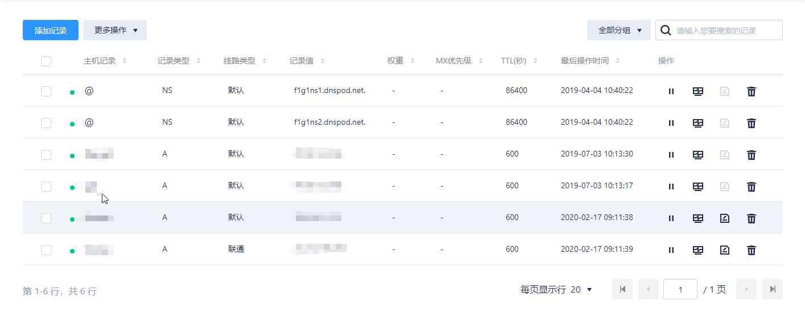

# ubnt_ddns
该解决方案实现通过域名访问无固定IP的内网服务器

实现思路是通过支持API修改DNS ip地址的DNS供应商(如DNSPOD), 定时将本地路由器获取的IP地址同步给DNS服务器. 

### 域名设置
首先注册DNS域名, 并设置好域名解析. 

到DNSPOD上申请并注册域名, 并做好域名解析




*对于双WAN口路由, 可以设置两种线路类型来对应ISP供应商.*

### UBNT 路由器设置
*路由器配置功能待补充*

将 Edge Router/get_ip.sh 文件拷贝到路由器中

### 服务器设置
*可以使用UBNT路由器作为服务器, 将后面的设置在路由Shell里设置即可*

#### SSH远程登录配置

  ```shell
    ssh-keygen -t rsa
    ssh-copy-id admin@router
  ```

#### NODE 配置
首先安装NODE,此处略

将Server/uploadDNS拷贝到服务器上, 并运行 npm install

#### 定时服务设置
将Server/syncip.sh拷贝到服务器上, 使用crond定时服务定时运行该脚本, 该脚本会ssh登录路由器, 获取路由器wan口ip地址, 然后调用uploadDNS程序将最新的ip地址发送给DNSPOD, 实现动态解析. 

